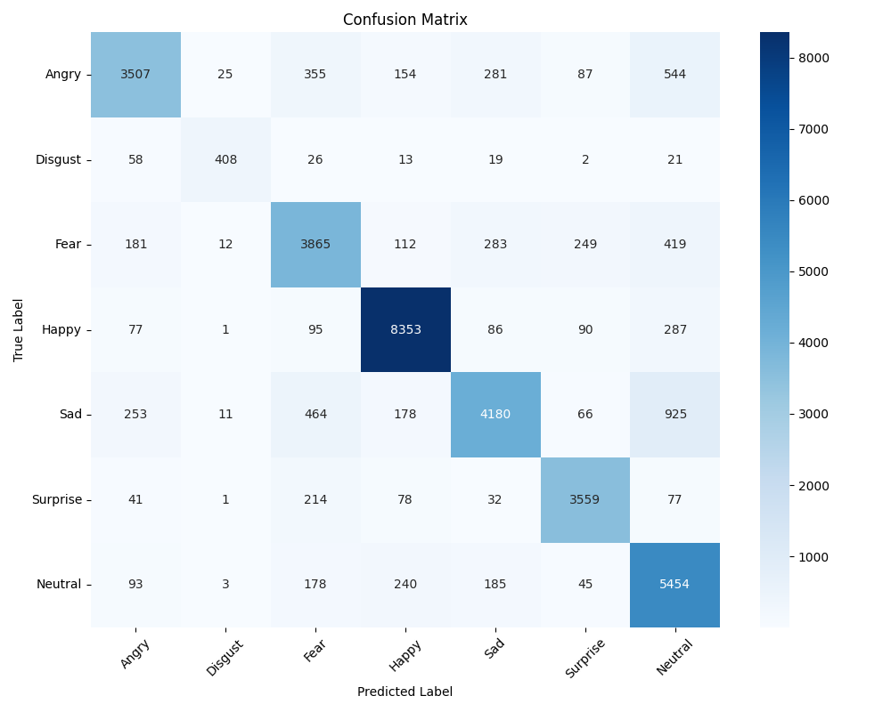
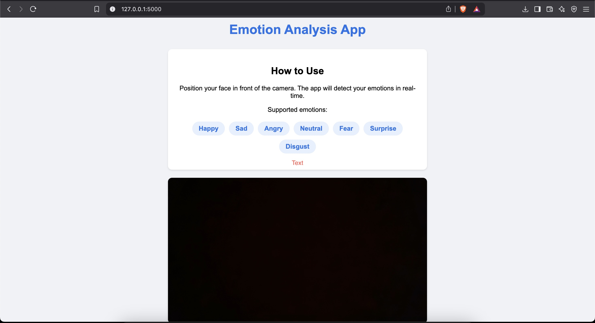

# Emotion Analysis Web App

A real-time emotion detection web application that uses deep learning to identify seven basic emotions from webcam input.

## Model Performance

The emotion detection model achieves the following performance metrics on the test set:
- Accuracy: 67.59%
- Loss: 0.9084

### Training Plots

#### Confusion Matrix


The confusion matrix shows the model's performance across different emotion categories. The diagonal elements represent the number of correct predictions for each emotion class.

## Features

- Real-time webcam capture and processing
- Emotion detection for seven basic emotions (Happy, Sad, Angry, Fear, Surprise, Disgust, Neutral)
- Web interface with live video feed
- Responsive UI with Bootstrap styling
- Face detection using OpenCV
- Deep learning model using TensorFlow

## Screenshot



## Project Structure

```
emotion_analysis/
├── app.py                 # Flask web application
├── download_model.py      # Script for model training
├── plot_training.py      # Script for generating training plots
├── requirements.txt      # Project dependencies
├── templates/           # HTML templates
│   └── index.html      # Main web interface
├── plots/              # Training plots and visualizations
│   └── confusion_matrix.png
└── FER-2013/          # Dataset directory
    ├── train/         # Training images
    └── test/          # Test images
```

## Setup Instructions

1. Create a virtual environment:
```bash
python -m venv venv
source venv/bin/activate  # On Windows: venv\Scripts\activate
```

2. Install dependencies:
```bash
pip install -r requirements.txt
```

3. Train the model:
```bash
python download_model.py
```

4. Generate training plots:
```bash
python plot_training.py
```

5. Run the application:
```bash
python app.py
```

6. Open a web browser and navigate to `http://localhost:5000`

## Technologies Used

- Python 3.11
- TensorFlow
- OpenCV
- Flask
- HTML/CSS
- NumPy
- Matplotlib
- Seaborn

## Model Architecture

The emotion detection model uses a Convolutional Neural Network (CNN) with the following architecture:
- Input layer: 48x48x1 (grayscale images)
- Multiple convolutional and pooling layers
- Dense layers with dropout for regularization
- Output layer: 7 units (one for each emotion)

## Dataset

The model is trained on the FER-2013 dataset, which contains:
- 28,709 training images
- 7,178 test images
- 7 emotion categories
- 48x48 pixel grayscale images

## License

This project is licensed under the MIT License - see the [LICENSE](LICENSE) file for details. 